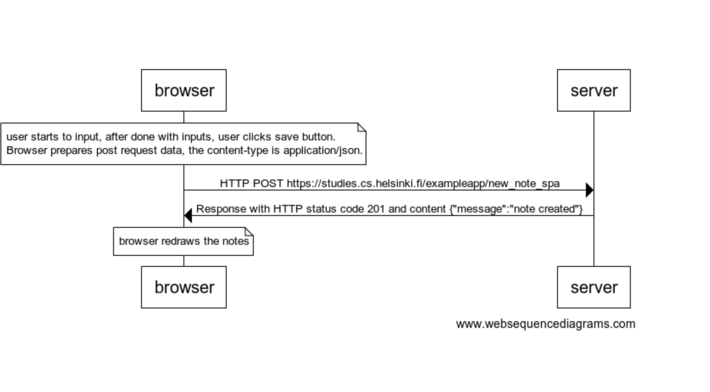

# 06.New note



```
note over browser:
user starts to input, after done with inputs, user clicks save button.
Browser prepares post request data, the content-type is application/json.
end note

browser->server: HTTP POST https://studies.cs.helsinki.fi/exampleapp/new_note_spa
server->browser: Response with HTTP status code 201 and content {"message":"note created"}

note over browser:
browser redraws the notes
end note
```
